# 二分搜索

如果没有关于A中元素次序的信息，那么扫描A中所有的项目是不可避免的
算法1.1 线性搜索
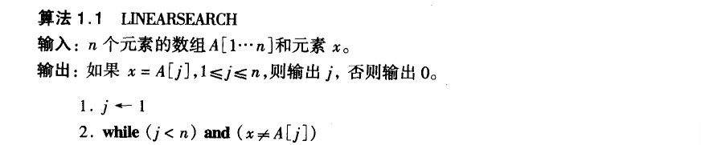  
  

若知道A中的元素按升序排列
算法1.2 二分搜索
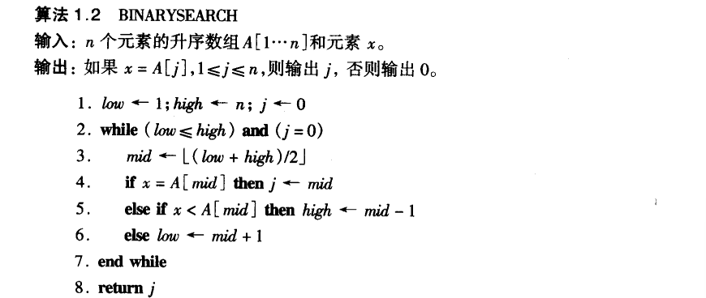  

### 二分搜索算法分析
最小循环次数是1

第二次迭代时剩余元素个数为$\lfloor n/2 \rfloor$
第j次迭代时剩余元素个数为$\lfloor $n/2^j-1^$ \rfloor$
最大循环次数发生在$\lfloor $n/2^j-1^$ \rfloor$=1时
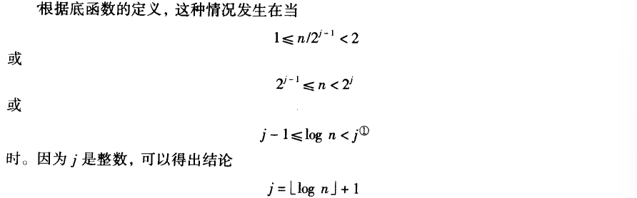  
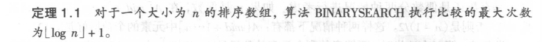  

# 合并两个已排序的表
算法1.3 二路归并算法
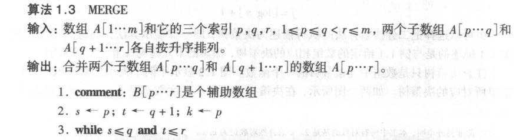  
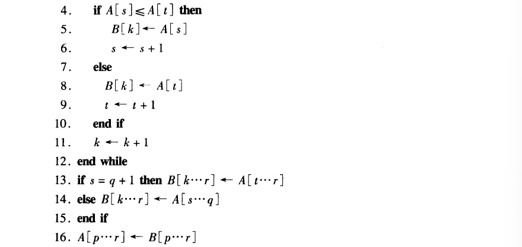  
最小比较次数是n~1~
最大比较次数是n-1
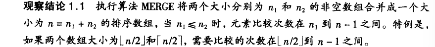  
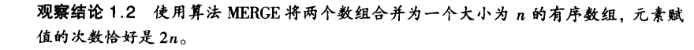  

#选择排序
算法1.4 选择排序
k中存放第i小元素的下标
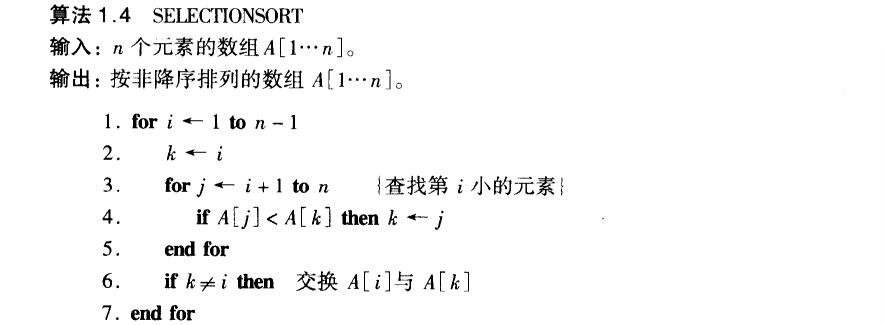  
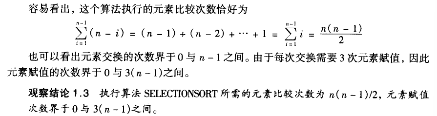 

# 插入排序
算法1.5 插入排序
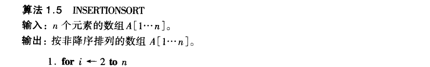  
  
 1](../../images/aaf260f033d850f8fe44f95f8e4963aa3fe63cc6a0d8894cdbb9fb20dcf91e5f.png)  
最小比较次数：n-1
最大比较次数：$\sum_1^{n-1}i$=$\frac{n(n-1)}2$
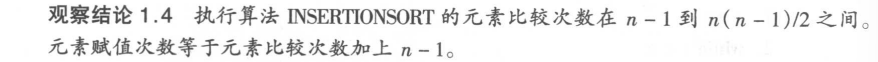  

