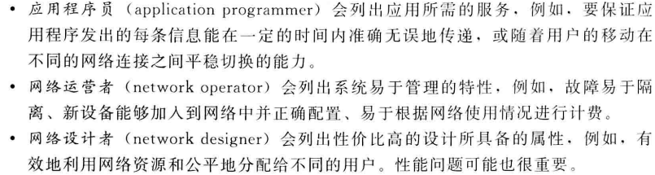
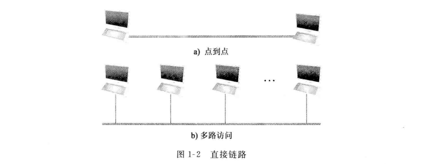

# 应用
### 应用分类
1. 万维网
2. 音频流和视频流
3. 实时音频和视频

# 需求
## 视角
  

## 可拓展的连通性
如果一个系统支持任意规模的扩展，则称为可拓展的
### 链路、节点和云形图
链路：直接连通两台或更多台计算机的物理介质（如同轴电缆或光纤）
节点：被连接的计算机
点到点链路：一条物理链路仅存在于一对节点之间
多路访问链路：多个节点可以共享一条物理链路
  
交换网类型：电路交换和分组交换。前者主要用于电话系统，后者用于绝大多数的计算机网络
分组交换网最主要的特点是网络中的节点彼此发送离散的数据块，每个数据块称为一个分组或一条消息