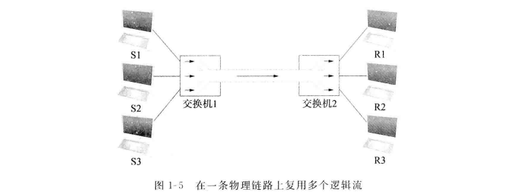

# 应用
### 应用分类
1. 万维网
2. 音频流和视频流
3. 实时音频和视频

# 需求
## 视角
  

## 可拓展的连通性
如果一个系统支持任意规模的扩展，则称为**可拓展的**
### 链路、节点和云形图
**链路**：直接连通两台或更多台计算机的物理介质（如同轴电缆或光纤）
**节点**：被连接的计算机
**点到点链路**：一条物理链路仅存在于一对节点之间
**多路访问链路**：多个节点可以共享一条物理链路
  

连着至少两条链路的节点运行软件将从一条链路收到的数据转发到另一条链路上。
如果将这些节点按系统化的方法进行组织，就形成一个**交换网**
  
图中的内部节点为**交换机**，基本功能是存储和转发分组；外部节点为**主机**，任务是支持用户并运行应用程序
交换网类型：**电路交换**和**分组交换**。前者主要用于电话系统，后者用于绝大多数的计算机网络，主要原因是效率较高
**分组交换网**最主要的特点是网络中的节点彼此发送离散的数据块，每个数据块称为一个分组或一条消息
分组交换网一般使用**存储转发策略**：存储转发网络中的每个节点先通过某条链路接收一个完整的分组，将这个分组存储在内存中，然后将整个分组转发给下一个节点
**电路交换网**首先通过一系列链路建立一条专用电路，然后允许源节点通过这条链路将比特流发送到目标节点

一些独立的网络（云）互联形成一个互联网
  
连接到两个或多个网络的节点称为**路由器**或**网关**，与交换机所起的作用大致相同
一个互联网可与多个互联网互联而成，可以递归构建任意大的网络

给每个节点指定一个**地址**，地址是标识节点的字节串，网络可以使用节点地址来区分该节点与连接到网络的其他节点
**路由**是根据目的节点地址来确定如何将消息转发给目的节点的过程

  

## 高性价比的资源共享
**多路复用**：系统资源在多个用户间共享
如下图，对应于3对主机的3个数据流通过交换机1**多路复用**1条物理链路，然后再由交换机2**多路分解**为独立的数据流
  
将多个数据流多路复用到一条物理链路上的不同方法：
1. **同步时分多路复用STDM**：将时间划分为等长的时间片，以轮转方式使每个数据流都有机会将数据发送到物理链路上
2. **频分多路复用FDM**：将每个流以不同的频率发向物理链路

都有两个方面的局限性：
1. 如果有一个流没有数据要发送，它占用的物理链路就会空闲，即使其他流此时有数据要发送也无法使用
2. STDM和FDM所容纳的数据流的最大数目是实现固定和已知的

使用最多的多路复用形式：**统计多路复用**：按照时间来共享物理链路，不同于STDM的是每个流的数据是根据需要传输的，而不是在一个预先规定的时间片传输
统计多路复用定义每个流在给定时间内允许传输的数据块大小的上界，这个限定大小的数据块通常称为一个**分组**（与应用程序可能传输的任意大小的**消息**区分）
在无法用一个分组发送一条完整的消息时，源节点需要将消息分划为几个分组，接收者再把这些分组重新组装成原始消息
  
在分组交换网中，每个交换机都能以分组为单位独立的决定发送顺序
  
  
局域网LAN：范围通常在1公里以内
广域网WAN：范围可以是世界范围的
城域网MAN：通常跨越几十公里
存储区域网（系统区域网）SAN：通常限制在一个房间里，并且把一个大的计算系统的各种组件连接起来。如光纤信道

## 支持通用服务
网络为应用层进程提供**逻辑信道**，使得它们能够基于逻辑信道相互通信，每个信道提供应用程序所需的服务集
  

**请求/应答信道**：保证由一方发送的每条消息都被另一方接收，并且每条消息只传输一份拷贝；还可以保证在其上传输的数据的隐私和完整性，未经授权不能读或修改客户与服务器进程之间交换的数据
**消息流信道**：可能不需要保证所有的消息都被发送，然而需要保证所传输的消息必须按发送的顺序到达；需要保证视频数据的隐私和完整性；需要支持多播，这样多方才能同时参与远程会议或观看视频
网络设计者必须考虑的故障：
1. 比特错：单个比特出错或多个比特出错（突发差错）
2. 丢失了整个分组，原因是分组含有不可纠正的比特错误，或一个必须处理该分组的节点由于过载而没有空间存储分组因而被迫丢掉，或处理分组的节点上运行的软件出现错误
3. 物理链路被切断或所连接的计算机崩溃

  
