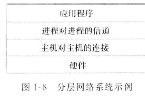
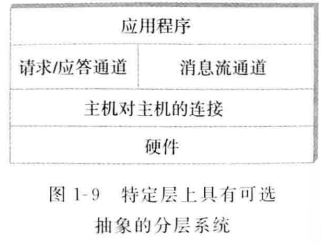
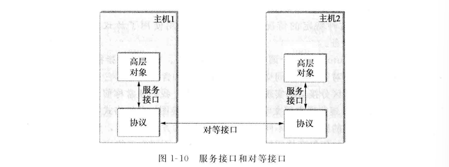
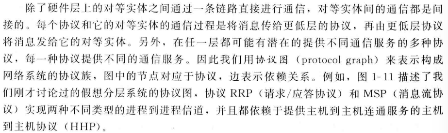
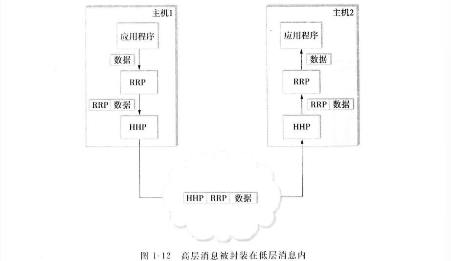
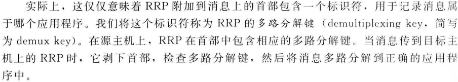
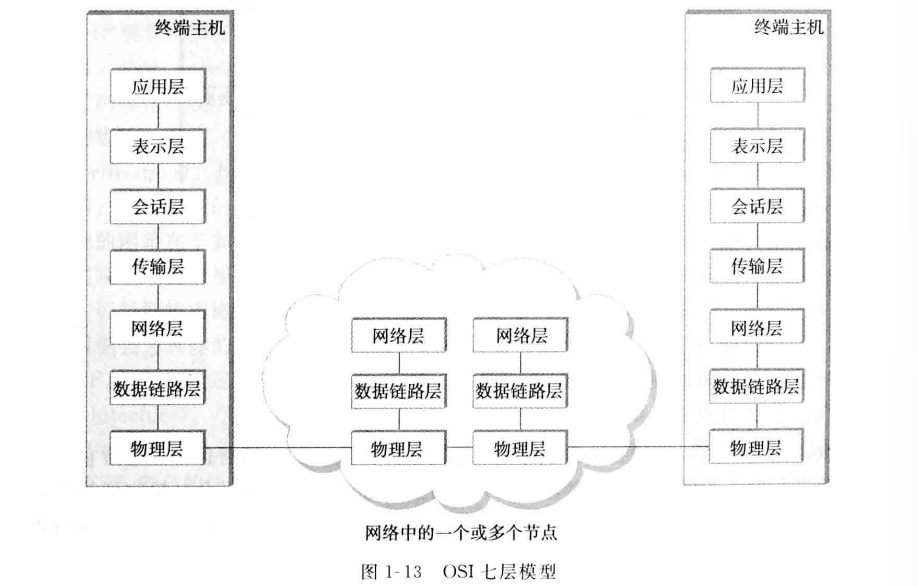
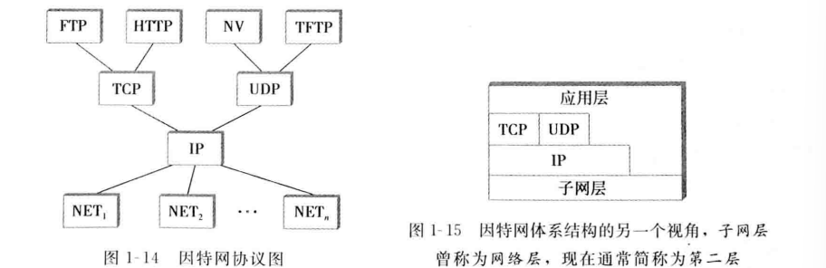
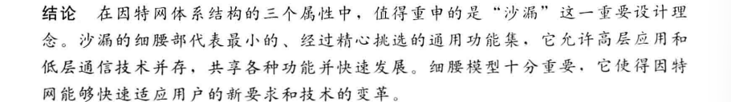

## 分层和协议
**分层**的优点：
1. 将建造网络的问题分解为多个可处理的部分
2. 提供一种更为模块化的设计
  

**协议**是构成网络系统分层的抽象对象，一个协议提供一种通信服务，供高层对象交换消息
每个协议定义两种接口：
1. 为同一计算机上想使用其通信服务的其他对象定义一个**服务接口**，定义了本地对象可在该协议上执行的操作
>一个请求/应答协议可支持应用的发送和接收消息的操作
>HTTP协议能够支持从远程服务器获取超文本页面的操作$
2. 为另一台机器上的对等实体定义了一个**对等接口**，定义了对等实体之间为实现通信服务而交换的消息的格式和含义

  
  
  
 1](../../images/cc3fe41b941993b7ba30ac6990cd1875820d6a65077444d11694bff7af39ada3.png)  

**网络体系结构**是一个协议图的格式和内容的规则的集合

### 封装
RRP将一个**首部**附加到消息上（有些情况要加的是**尾部**），首部的确切格式是由其协议规范定义的，其余部分称为**消息体**或**有效载荷**。我们称应用程序的数据被封装在一个由RRP协议创建的新消息中
封装过程在协议图的每一层都被重复，当消息到达目的主机时，它将以相反的顺序被处理
  

### 多路复用和多路分解
  

### 七层模型
  
**物理层**处理通信链路上原始比特的传输
**数据链路层**收集比特流形成一个更大的集合体，称为帧，实际传输给主机的是帧
**网络层**处理一个分组交换网内节点的路由，节点间交换的数据单元通常称为**分组**而不是帧，尽管是一回事
较低的三层在所有网络节点中都要实现
**传输层**实现我们提到过的进程到进程信号，在此交换的数据单元通常称为**消息**而不是分组或帧
传输层和更高层通常只在终端主机上运行，而不在中间交换机和路由器上运行
**应用层**协议包括超文本传输协议（HTTP）等
**表示层**关注对等实体间交换的数据的格式
**会话层**提供一个命名空间，用来将一个应用的各部分不同的传输流联系在一起

## 因特网体系结构
有时也称为TCP/IP体系结构，因为TCP和IP是它的两个主要协议
  
最底层是多种网络协议，表示为NET~1~等，这些协议由硬件（网络适配器等）或软件（网络设备驱动程序等）共同实现，以太网或无线协议就会出现在这一层
第二层只有一个**网际协议**（IP），支持多种网络技术互联为一个逻辑网络
第三层包括**传输控制协议**（TCP）和**用户数据报协议**（UDP），为应用程序提供可选的逻辑信道：TCP提供可靠的字节流信道，UDP提供不可靠的数据报传输信道，这二者有时被称为端到端协议

因特网体系结构和七层OSI体系结构的关系：因特网的应用层看成第七层，传输层是第四层，IP层是第三层，IP层下面的链路或子网层是第二层
互联网体系结构特点：
1. 没有严格划分层，应用可以自由地跨过已定义的传输层
2. IP层作为体系结构的焦点，为各种网络中的交换分组定义一种通用方法
3. 为了将一个新协议正是包含在网络体系结构中，必须有一个协议规范并至少有一个该规范的典型实现

  
