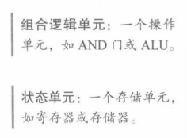
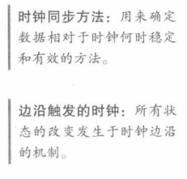
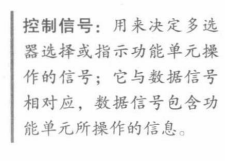

  
组合逻辑单元：处理数据值的单元，输出仅依赖于当前输入
状态单元：有内部存储功能
状态单元至少有两个输入和一个输出，输入是要写入状态单元的数据值和决定何时写入数据值的时钟信号，输出提供了在前一个时钟周期写入单元的数据值
## 时钟同步方法
  
时钟同步方法规定了信号可以读出和写入的时间
  
如果状态单元在每个有效时钟边沿都进行写入，则可忽略写控制信号；反之则需要一个写控制信号
仅当时钟边沿到来且写控制信号有效时，状态单元才改变状态