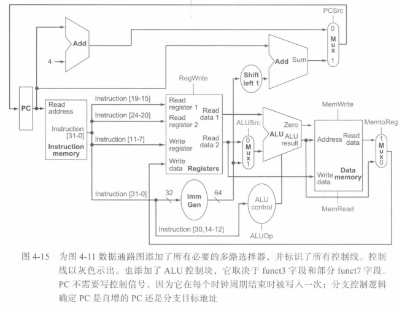

## ALU控制
  
* 对于load和store指令，ALU做加法计算存储器地址
* 对于R型指令，ALU根据7位funct7字段和3位funct3字段执行四种操作中的一种
* 对于条件分支指令，ALU将两个操作数做减法并检测结果是否为0

4位ALU的输入控制信号由一个小型控制单元产生，其输入是指令的funct7和funct3字段以及2位的ALUOp字段
  

注：ALU不使用11~2~编码
  
## 设计主控制单元
  
  

除PCSrc控制信号外，所有控制信号可由控制单元仅根据指令的操作码和funct字段设置
当指令是beq时并且做相等检测的ALU零输出有效时，PCSrc控制信号有效
  
  

注：当RegWrite信号为0时，MentoReg字段无关紧要
  
  
