  
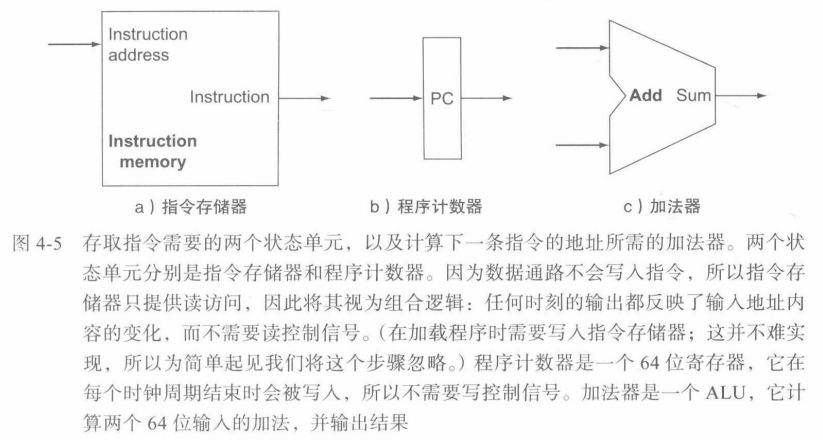  
执行任意一条指令，首先从存储器中取出指令，再增加程序计数器的值（向后移动四个字节）使其指向下一条指令
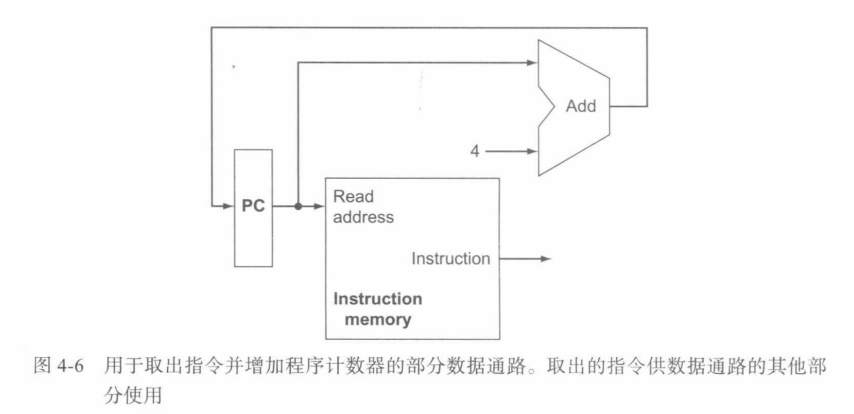  
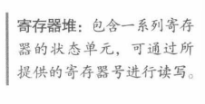 
每条R型指令需要从寄存器堆中读出两个数据字，再写入一个数据字
读数据时，需要
* 1个输入：指定要读的寄存器号
* 1个输出：从寄存器堆读出的数据

写数据时，需要
* 2个输入：要写的寄存器号和要写入寄存器的数据
* 写信号受到写控制信号控制

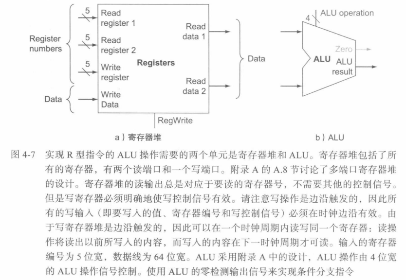  
ALU读取两个64位输入并产生一个64位输出，还有一个1位输出指出其结果是否为0

存取指令通过将基址寄存器与指令中包含的12位有符号偏移量相加得到存储器地址，还要在寄存器中读出/写入要存储/读取的数据
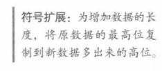  
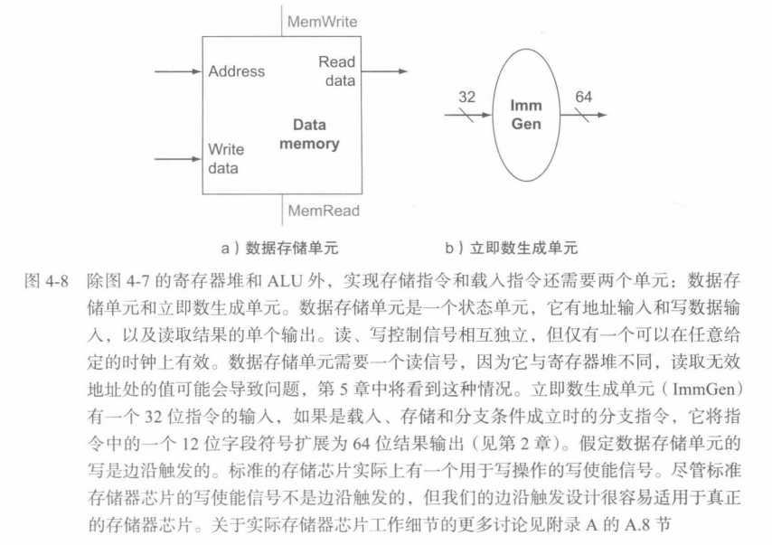  

beg指令使用两个寄存器比较是否相等，并使用一个12位偏移量计算分支指令所在地址的分支目标地址
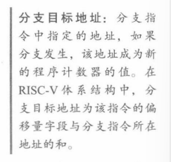  
  
 1](../../images/65367034192874474237cf5c8c2f94cdb6bc774b89ef153c50b64502a7b60919.png)  
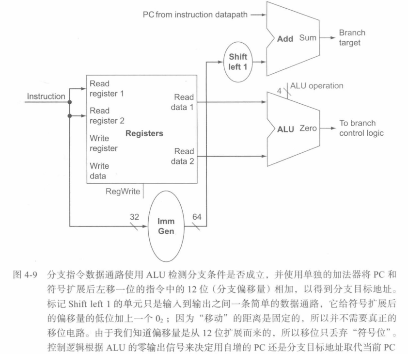  

## 建立一个简单的数据通路
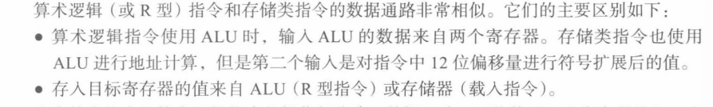  
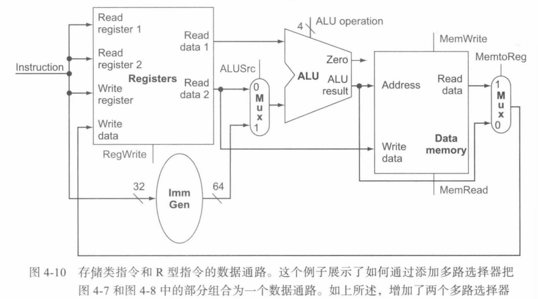  
把取指令数据通路、R型指令和存储类指令数据通路、分支指令数据通路合并：
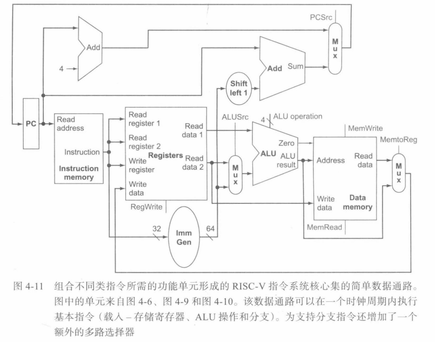  
