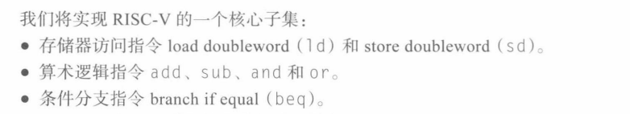
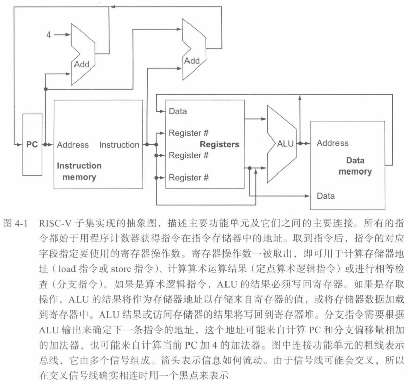
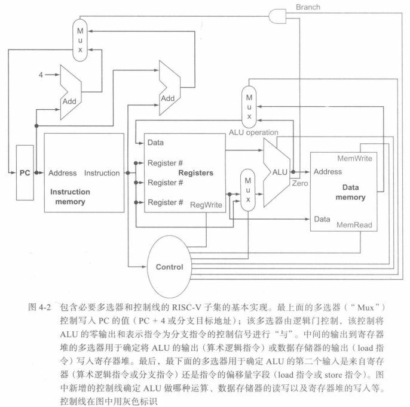

程序需要的指令数由编译器和指令系统体系结构共同决定
时钟周期长度和CPI由处理器的实现方式决定
## 一种基本的RISC-V实现
  
## 实现概述
实现每条指令的前两个步骤是相同的
1. 程序计数器(PC)发送到指令所在的存储单元，并从中取出指令
2. 根据程序的某些字段选择要读取的一两个寄存器

完成指令所需的剩余操作取决于指令类别（基本是相同的）
所有类型的指令在读取寄存器后都使用ALU：
* 存储器访问指令进行地址运算
* 算术逻辑指令执行运算
* 条件分支指令进行比较

经过ALU之后，完成各类指令所需的操作就不同了
* 存储器访问指令访问存储器以读取数据或存储数据
* 算数逻辑指令或载入指令将来自ALU或存储器的数据写回寄存器
* 条件分支指令根据比较结果更改下一条指令的地址

下图忽略了多路选择器和控制线
数据存储器在指令是load时被读，在指令是store时被写
寄存器堆只能在指令是load或算术逻辑指令时被写
  
下图增加了三个必要的多选器和主要功能单元的控制线
  
