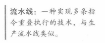

  
RISC-V指令执行通常包含五个步骤：
  

  
流水线处理器上的指令执行时间等于
  
流水线技术通过提高指令**吞吐率**来提高性能，而不是减少单个指令的执行时间、
## 流水线冒险
  

  
  
  
  
  
  
 1](../../images/9d28c7bd0c125627fb5b97efcd5d470e2f0a86e56a6e978c2da7851f4c46229d.png)  

  
  
  
  

