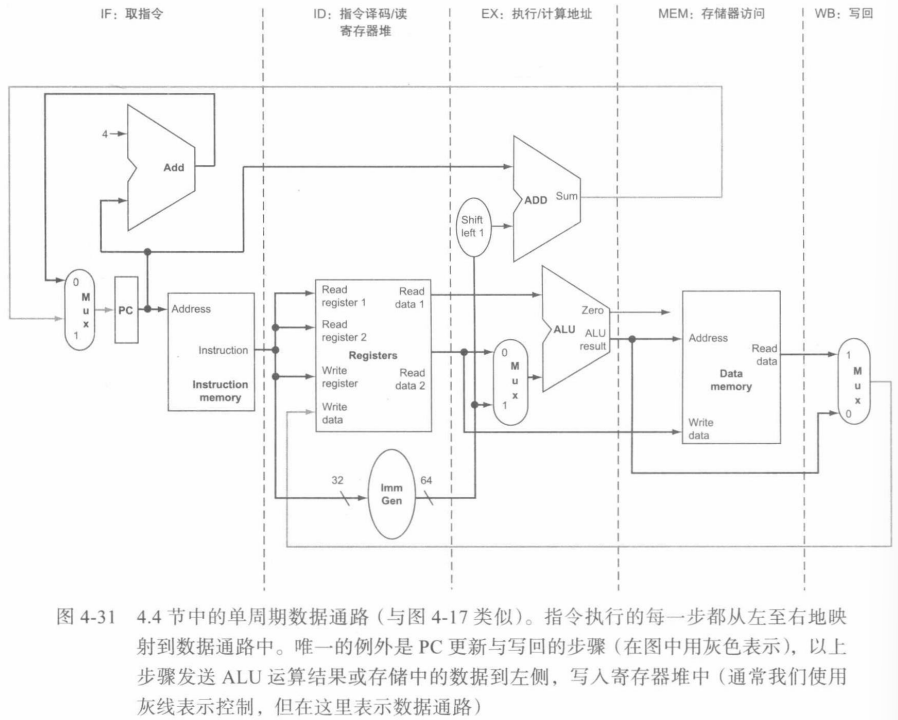  
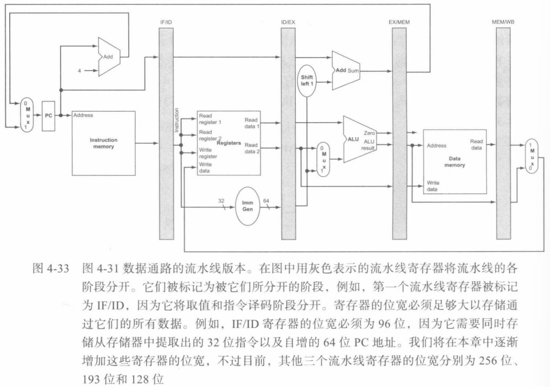  
存储指令的五个执行步骤：
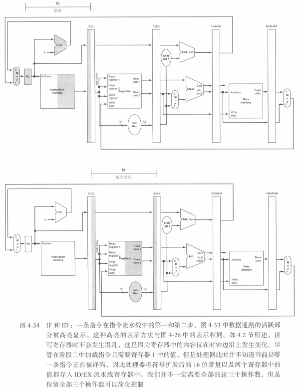  
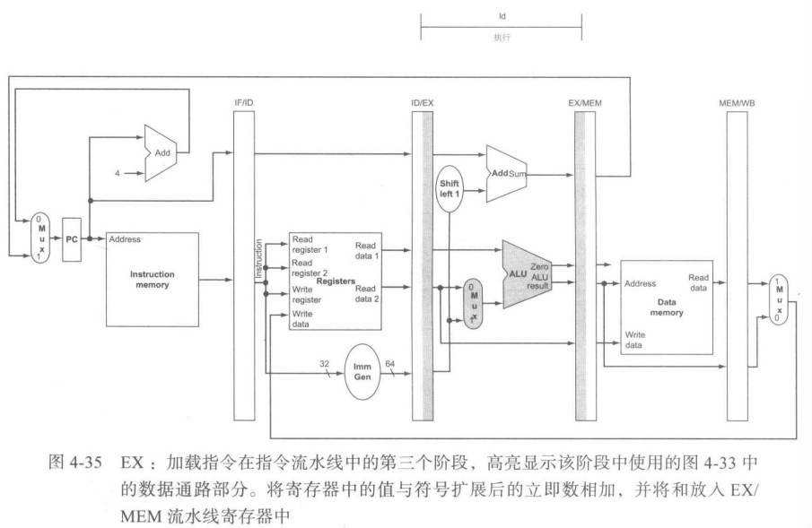  
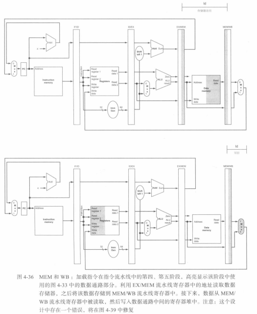  
存储指令的五个执行步骤：
取指、译码和读寄存器堆部分与图4-34相同
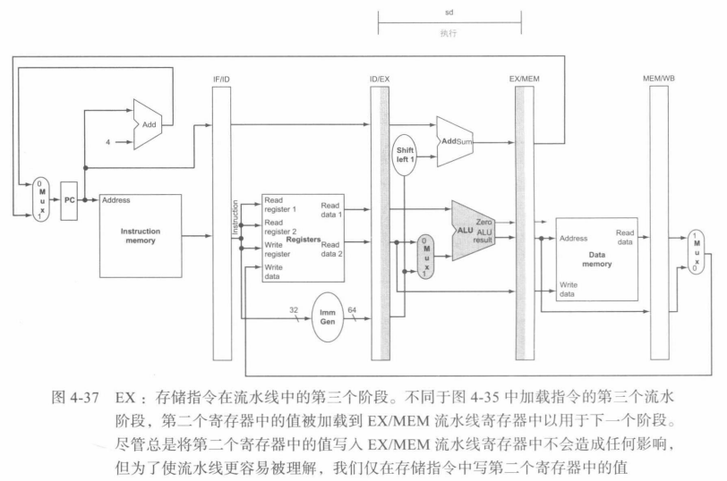  
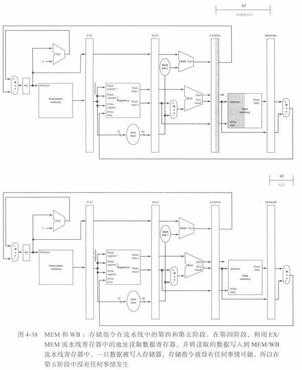  
对于流水线数据通路的修正：
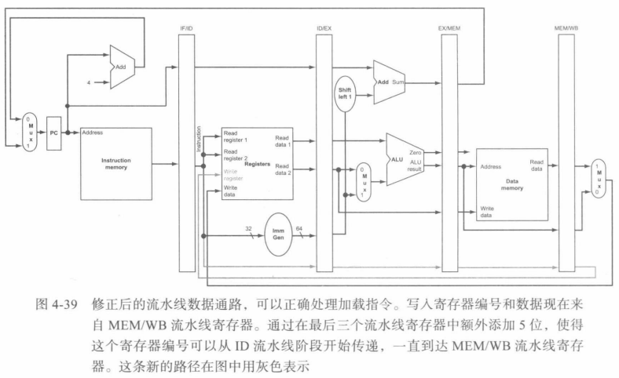  
## 流水线的图形化表示、
多时钟周期流水线图：
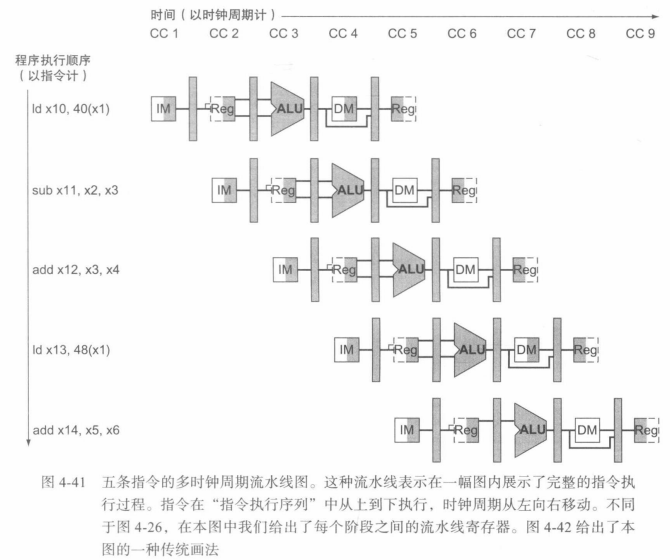  
单时钟周期流水线图：
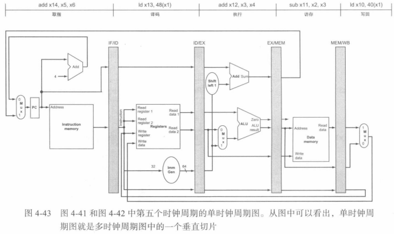  
## 流水线控制
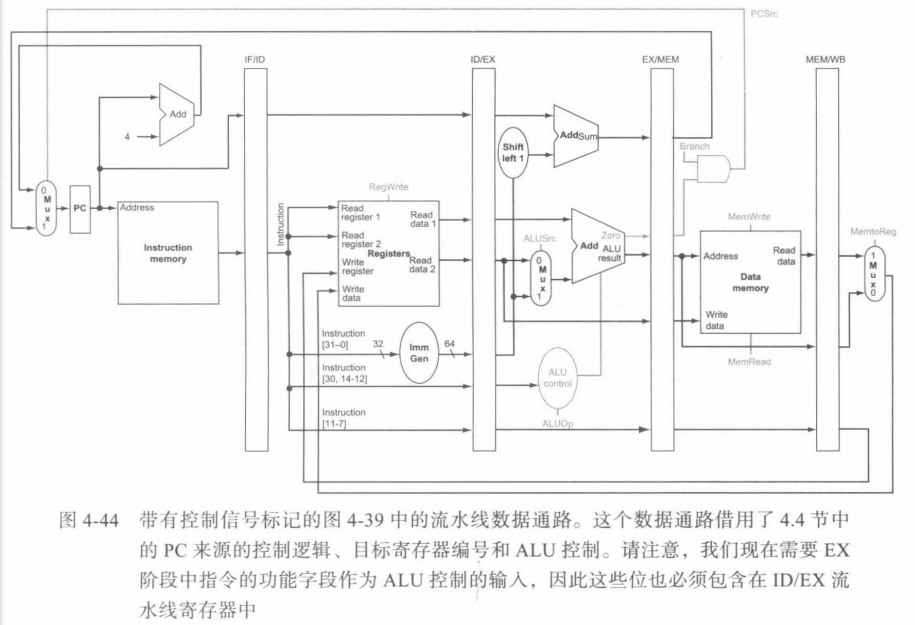  
  
 1](../../images/5a6bb2dad8b32f142d0bfec7990efc97928873de89de3907037ccb19e7267def.png)  
控制线的划分：
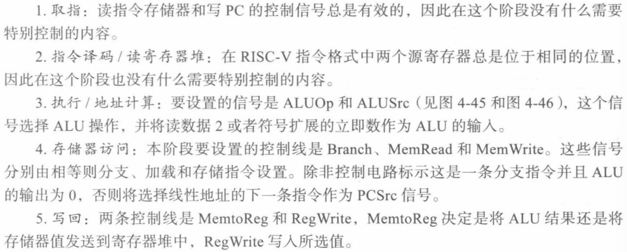  
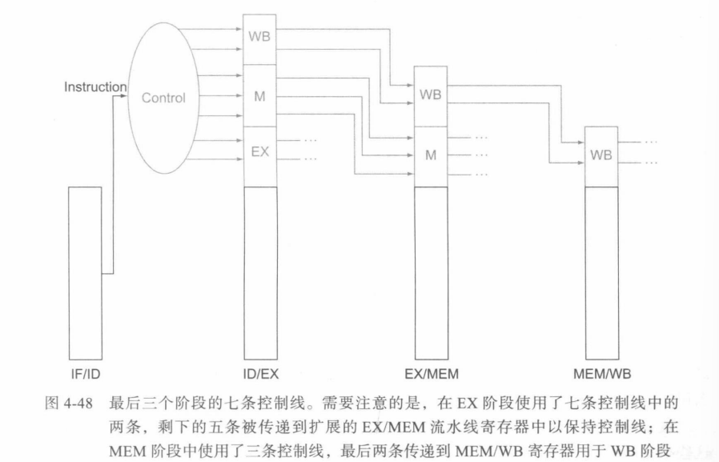  
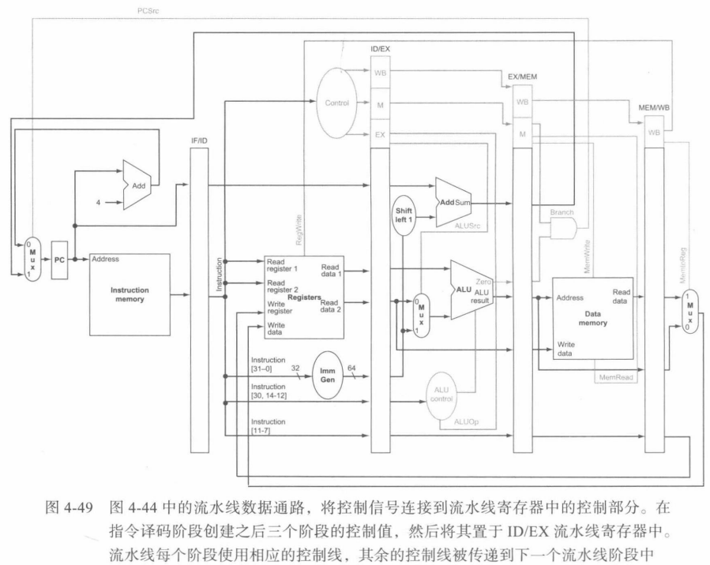  
